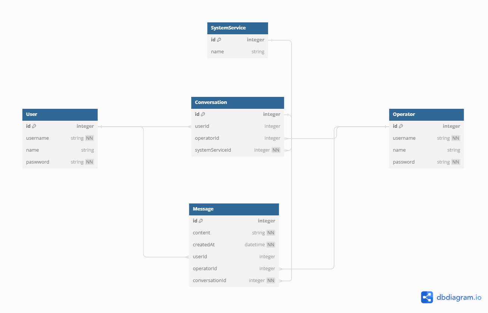

# Legend of Kaldi - test rest API
This project is part of technical interview for company Kaldi.

## Description
This is simple `NestJS` backend application that supports some of CRUD operations based on SQLite database under it.

## Technical background
Backend service is build on `NestJS` framework, for database is using `SQLite` database that is part of this repository. As ORM `Prisma` is used.

Inside `/postmanCollection` is export of Postman Collection to quickly try implemented API endpoints. Project also supports `SwaggerUI`, which is exposed on `/swagger`˙path.

### Database model

Picture bellow describes database relationships:




## Getting Started

### Dependencies

Before installing script, you need to have `node` and `npm` installed on your computer.

Project dependencies can later be installed using

```
npm install
```

### Installing and executing

After you run `npm install` you can start dev server using

```bash
# development
$ npm run start

# watch mode
$ npm run start:dev

# production mode
$ npm run start:prod
```

App will be available on [http://localhost:3000](http://localhost:3000).
